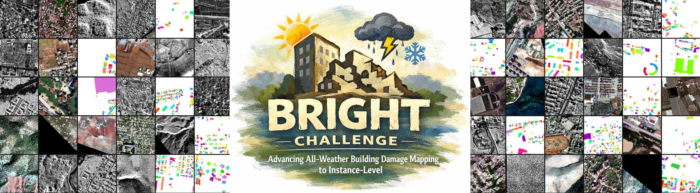

<div align="center">
<h3>BRIGHT Challenge: Advancing All-Weather Building Damage Mapping to Instance-Level</h3>


[](https://essd.copernicus.org/articles/17/6217/2025/essd-17-6217-2025.html) [](https://zenodo.org/records/14619797)   [](https://huggingface.co/datasets/Kullervo/BRIGHT) [](https://zenodo.org/records/15349462) 
</div>


<p align="center">
  
</p>


## 🔭 Overview
Mask R-CNN baseline for multimodal building damage instance segmentation on BRIGHT, which is part of [Monitoring the World Through an Imperfect Lens (MONTI)](https://sites.google.com/view/monti2026/home) in conjunction with CVPR 2026 Conference.

- Input: pre-event RGB + post-event SAR
- Classes: `intact`, `damaged`, `destroyed`
- Main metric: `segm_AP`

This repo follows the public competition setting:

- participants receive all `train` / `val` / `holdout` images
- participants receive labels only for `train` and `val`
- `holdout` is used only for inference submission
- final `holdout` scoring is done on the server with private GT

## ⚙️ Setup

Install:

```bash
conda create -n bright_cvprw26 python=3.10 -y
conda activate bright_cvprw26
pip install -e .
```

Key dependencies installed via `pyproject.toml`:

| Package | Version | Purpose |
|---|---|---|
| `torch` | ≥ 2.0 | Deep learning framework |
| `torchvision` | ≥ 0.15 | Mask R-CNN backbone and transforms |
| `numpy` | 1.26.4 | Array operations |
| `albumentations` | 1.4.24 | Data augmentation |
| `rasterio` | latest | GeoTIFF I/O |
| `pycocotools` | latest | COCO format utilities |
| `faster-coco-eval` | latest | Fast COCO mAP computation |
| `opencv-python-headless` | latest | Image processing |
| `supervision` | latest | Visualization utilities |

> Requires CUDA-capable GPU. Install PyTorch with CUDA support manually if `pip` installs the CPU-only version.

Expected dataset layout:

```text
<BRIGHT_ROOT>/  
├── post-event/
├── pre-event/
└── target_instance_level/  
```

Repo-side files:

```text
data/
├── splits/
│   ├── train_set.txt
│   ├── val_set.txt
│   └── holdout_set.txt
└── instance_annotations/
    ├── train.json
    ├── val.json
    └── holdout.json
```

`holdout.json` is a public images-only COCO manifest. It does not contain public holdout labels.

Before running, check these fields in [config/disaster.yaml](config/disaster.yaml):

| Field | Description | Example |
|---|---|---|
| `data.root` | Root directory of the BRIGHT dataset | `/data/BRIGHT` |
| `data.images_dir` | Post-event SAR directory (relative to root) | `post-event` |
| `data.pre_event_dir` | Pre-event RGB directory (relative to root) | `pre-event` |
| `train.output_dir` | Directory for checkpoints and logs | `outputs/` |
| `infer.checkpoint` | Trained model checkpoint for inference | `outputs/best_model.pth` |
| `infer.output_json` | Output path for the submission JSON | `outputs/infer/predictions.json` |

If your release package already includes merged `train.json`, `val.json`, and `holdout.json`, you can skip annotation preparation. Otherwise run:

```bash
python tools/merge_coco_json.py \
  --json-dir <BRIGHT_ROOT>/target_instance_level \
  --image-dir <BRIGHT_ROOT>/post-event \
  --pre-event-dir <BRIGHT_ROOT>/pre-event \
  --splits-dir data/splits \
  --output-dir data/instance_annotations
```

This creates:

- labeled `train.json`
- labeled `val.json`
- images-only `holdout.json`

If organizers need labeled holdout annotations for server evaluation:

```bash
python tools/merge_coco_json.py \
  --json-dir <BRIGHT_ROOT>/target_instance_level \
  --image-dir <BRIGHT_ROOT>/post-event \
  --pre-event-dir <BRIGHT_ROOT>/pre-event \
  --splits-dir data/splits \
  --output-dir data/instance_annotations \
  --holdout-mode annotations
```

## 🚀 Workflow

Train:

```bash
python -m src.train --config config/disaster.yaml
```

Or use the cluster wrapper:

```bash
bash train.sh
```

Run inference on `holdout` and generate the submission file:

```bash
python -m src.infer --config config/disaster.yaml
```

Or:

```bash
bash infer.sh
```

Notes:

- gzip is enabled by default, so the output is usually `predictions.json.gz`
- use `--no-gzip` if you need plain JSON
- use `--visualize` to save visualization images

Example:

```bash
python -m src.infer --config config/disaster.yaml --visualize --vis-score-thr 0.5
```

<!-- For local infer+eval on a labeled split, run:

```bash
python -m src.test --config config/disaster.yaml
``` -->

By default this evaluates on `val.json`.

## 📊 Evaluation

Participant side:

- upload the `holdout` prediction file to the [challenge server](https://www.codabench.org/competitions/15134/)
- no public `holdout` metric is available locally

Server side:

Use the self-contained script [src/eval.py](src/eval.py):

```bash
python src/eval.py \
  --gt /path/to/private_holdout_gt.json \
  --predictions outputs/infer/predictions.json.gz
```

It reports: `mAP`, `AP50`, `AP75`, `intact`, `damaged`, `destroyed`.

## 🏆 Baseline Performance

Evaluated on the `val` and `holdout` split after 100 epochs of training with default `config/disaster.yaml`:

| Split | mAP | AP50 | AP75 | Intact | Damaged | Destroyed |
|-------|---------|------|------|--------|---------|-----------|
| Validation  | 0.1854   | 0.3540 | 0.1792 | 0.2861  | 0.1337 | 0.1365   |
| Holdout  | 0.1839   | 0.3360 | 0.1862 | 0.3068  | 0.1034 | 0.1416   |

## 📁 Outputs

Training:

- `outputs/latest.pth`
- `outputs/best_model.pth`
- `outputs/train.log`
- `outputs/eval/eval_results_epochXXX.json`

Inference:

- `outputs/infer/predictions.json.gz` by default
- `outputs/infer/vis/` if visualization is enabled

Local test:

- `outputs/test/predictions.json`
- `outputs/test/predictions_metrics.json`

Main files:

- [src/train.py](src/train.py): training
- [src/infer.py](src/infer.py): submission inference
<!-- - [src/test.py](src/test.py): local labeled evaluation -->
- [src/eval.py](src/eval.py): server-side holdout evaluation
- [tools/merge_coco_json.py](tools/merge_coco_json.py): split annotation preparation

## 📜 Reference
If this dataset or code contributes to your research, please kindly consider citing our paper and give this repo ⭐️ :)

```bibtex
@Article{Chen2025Bright,
    AUTHOR = {Chen, H. and Song, J. and Dietrich, O. and Broni-Bediako, C. and Xuan, W. and Wang, J. and Shao, X. and Wei, Y. and Xia, J. and Lan, C. and Schindler, K. and Yokoya, N.},
    TITLE = {\textsc{Bright}: a globally distributed multimodal building damage assessment dataset with very-high-resolution for all-weather disaster response},
    JOURNAL = {Earth System Science Data},
    VOLUME = {17},
    YEAR = {2025},
    NUMBER = {11},
    PAGES = {6217--6253},
    DOI = {10.5194/essd-17-6217-2025}
}
```
